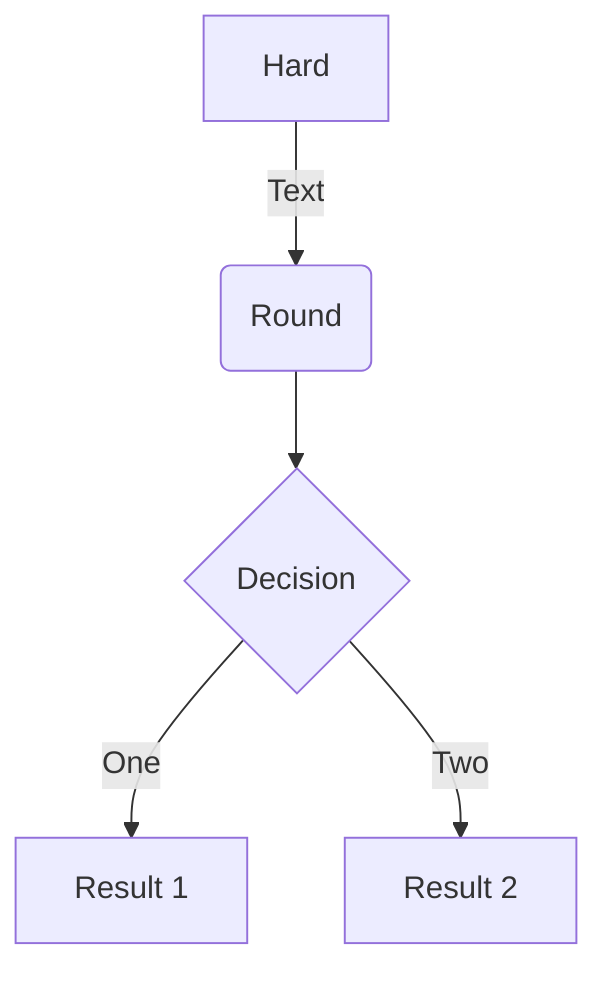
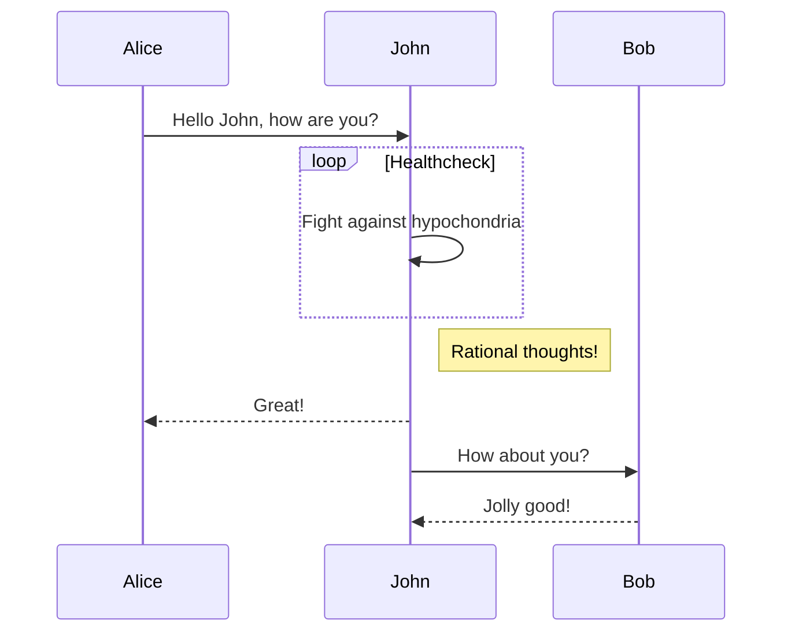
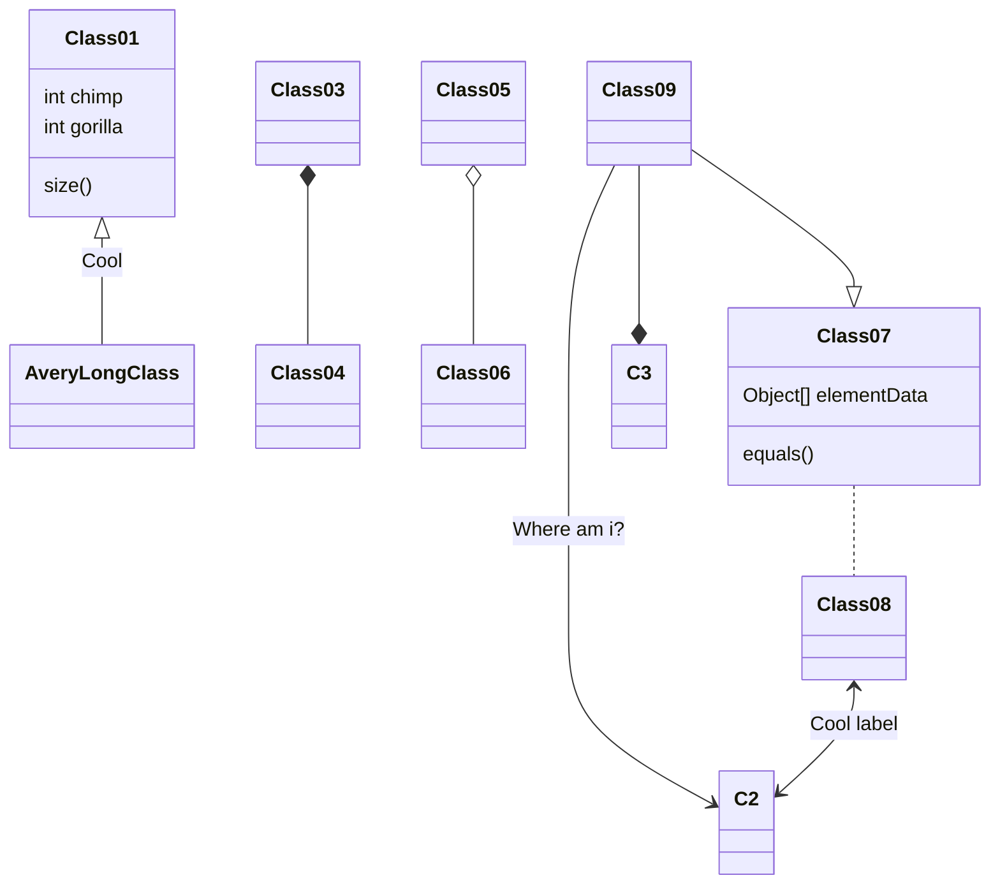
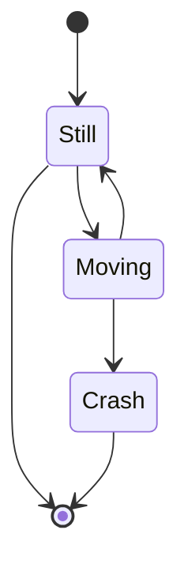

Absolute Zero is a four-wheel-drive beetleweight combat robot which utilizes a "vertical spinner" weapon to damage opponents. It was my first beetleweight design, which has now been iterated upon numerous times and is still actively competing to this day. This post will go into detail on all of the components of the robot and why things are the way they are, give a brief top-level overview of the robot, and describe any important design decisions or changes I made along the way.

## Top-Level Overview

Colloquially, Absolute Zero (AZ) is considered a "4WD Vertical Spinner." Kinetic weapons are usually referred to by the direction they spin, with vertical spinners spinning upwards and horizontal spinners spinning sideways. I'll avoid going into too much robot detail here given that everything is explained further down in this post, so to go over some of the important features:

Power: 4S 1100mAh Li-HV Battery (16.8V)

Electronics: 50A Weapon ESC, 25A Drive ESCs, Fingertech Power Switch, Radiomaster R84 V2 Receiver 

Drive: 4WD, 1.875" Urethane Wheels

Chassis: 95A TPU, 3/8" UHMW, 2mm Carbon Fiber, 0.0625" 6061-Aluminum

Weapon: AR500 Vertical Drisk (Dual Disk), 350 MPH Theoretical Tip Speed

Front-End: Grade 5 Titanium Flaps

Absolute Zero V3 was designed in Onshape using a series of master sketches and a Multi-Part Part Studio which controls all of the critical geometry of the robot, and allowed me to easily have all of the robot's components reference geometry either from the master sketches using the Derive Tool, or reference geometry on other parts of the robot.

Save your Plotly JSON in your page folder, for example `line-chart.json`, and then add the `` shortcode where you would like the chart to appear.

Demo:



You might also find the [Plotly JSON Editor](http://plotly-json-editor.getforge.io/) useful.

## Material Selection and Design Philosophy

Wowchemy supports the _Mermaid_ Markdown extension for diagrams.

An example **flowchart**:

    ```mermaid
    graph TD
    A[Hard] -->|Text| B(Round)
    B --> C{Decision}
    C -->|One| D[Result 1]
    C -->|Two| E[Result 2]
    ```

renders as



An example **sequence diagram**:

    ```mermaid
    sequenceDiagram
    Alice->>John: Hello John, how are you?
    loop Healthcheck
        John->>John: Fight against hypochondria
    end
    Note right of John: Rational thoughts!
    John-->>Alice: Great!
    John->>Bob: How about you?
    Bob-->>John: Jolly good!
    ```

renders as



An example **class diagram**:

    ```mermaid
    classDiagram
    Class01 <|-- AveryLongClass : Cool
    Class03 *-- Class04
    Class05 o-- Class06
    Class07 .. Class08
    Class09 --> C2 : Where am i?
    Class09 --* C3
    Class09 --|> Class07
    Class07 : equals()
    Class07 : Object[] elementData
    Class01 : size()
    Class01 : int chimp
    Class01 : int gorilla
    Class08 <--> C2: Cool label
    ```

renders as



An example **state diagram**:

    ```mermaid
    stateDiagram
    [*] --> Still
    Still --> [*]
    Still --> Moving
    Moving --> Still
    Moving --> Crash
    Crash --> [*]
    ```

renders as



## Chassis

Save your spreadsheet as a CSV file in your page's folder and then render it by adding the _Table_ shortcode to your page:

```go

```

renders as



## Weapon System

## Drive System

## Electronics

## Front-End Configurations
